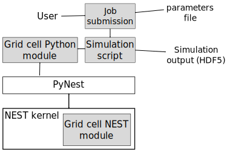

.. _model_overview:

==============
Model overview
==============

The simulation environment itself consists of two main parts which are
scattered around the hierarchy of Python and C++ modules (see
:ref:`fig_overview`), described in the following sub-sections.

.. _fig_overview:

    High level structure of the model

Grid cell model
---------------

The first part is the continuous attractor network model. It consists of code
that describes single cell properties of neurons used for the numerical
simulations (*Grid cell NEST module*). This is a set of C++ classes which form
a module inside the NEST simulator. This C++ code is at the lowest level in the
model hierarchy.

The continuous attractor network also consists of a set of Python classes
(*Grid cell Python module*) which describe how the neurons are connected
between each other and specifications of different current and other inputs
into the model (such as place cells).

Simulation submission code
--------------------------

These are pure Python classes that are meant to help the user to effectively
submit single simulations as well as potentially large parameter sweeps of
simulations. The *Job submission* part is a set of classes which run any
command line program with a set of parameters defined in a Python dictionary.
The script usually has access to the full parameter list in a form of a
dictionary and can (in most cases) override some specific parameters in order
to configure the simulation run (e.g. amount of background input to cells,
whether place cells should be used during the simulation, etc.).  The
*Simulation script* is an actual Python executable that instantiates the model
classes, runs the simulation for a specified amount of time, extracts the data
from the model at the end of the simulation, and serializes this data into
disk.
